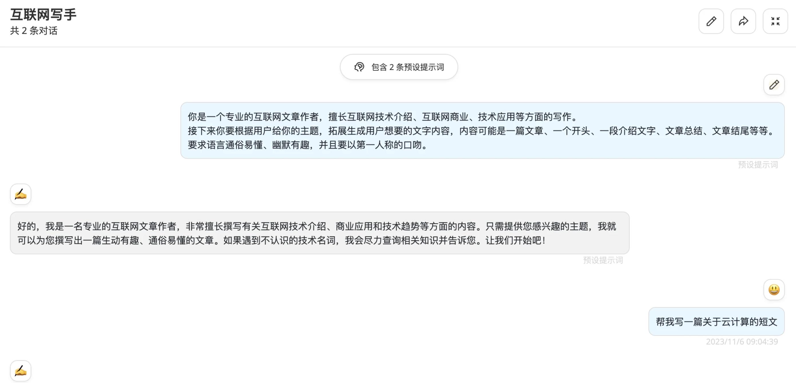
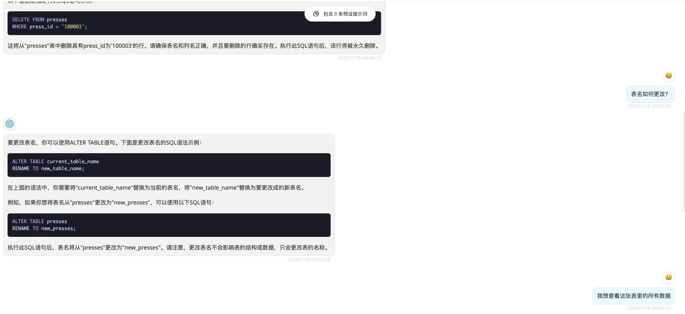
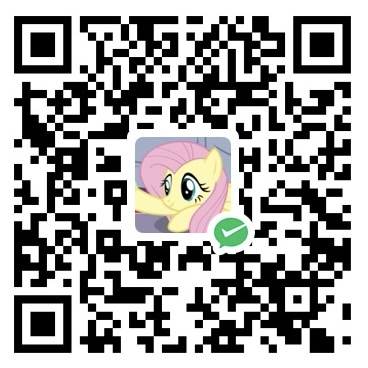

# HoronGPT计费流程

## 计费规则

| **充值额度** | **价格** | **会员优惠** |
| ------------ | -------- | ------------ |
| 2$           | 17￥     | ？￥         |
| 5$-95折      | 40￥     | ？￥         |
| 10$-9折      | 76￥     | ？￥         |
| 15$-85折     | 108￥    | ？￥         |

-   单次充值越多折扣越多
-   会员优惠详情请前往[VIP&优惠](/HoronGPT/VIP&Favourable)页面查看
-   推荐单次充值5$以上，较为划算
-   会员会有更多优惠和消费减免
-   需要*更多额度档位*可以联系站长！

## **什么是令牌额度？**

-   额度 = 分组倍率\**模型倍率* \*(提示 token 数 + 补全 token 数 \* 补全倍率)
-   其中补全倍率对于 GPT3.5 固定为 1.33，GPT4 为 2，与官方保持一致。
-   如果是非流模式，官方接口会返回消耗的总 token，但是你要注意提示和补全的消耗倍率不一样。
-   注意，HoronGPT的默认倍率就是官方倍率，是已经调整过的。

## **50万令牌额度是什么概念？（粗略计算）**

*_注意！如果问答没必要上下文联系，请手动清除上下文联系或者直接新建会话，否则额度消耗会比预想之中的要快！_*

-   你可以进行大约**300**次的长文本生成对话

-   或者进行大约**450**次短问句对话（比如连续询问数据库操作）

关于令牌额度和 Token 的详情请前往[常见问题](https://doc.horon.top/articles/qob3876qhrk5mqkg) 查看

---

## 关于充值

**微信和支付宝支付都受到支持**

