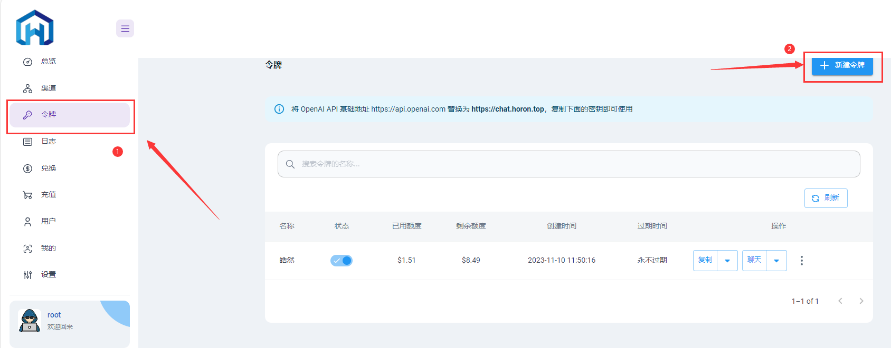
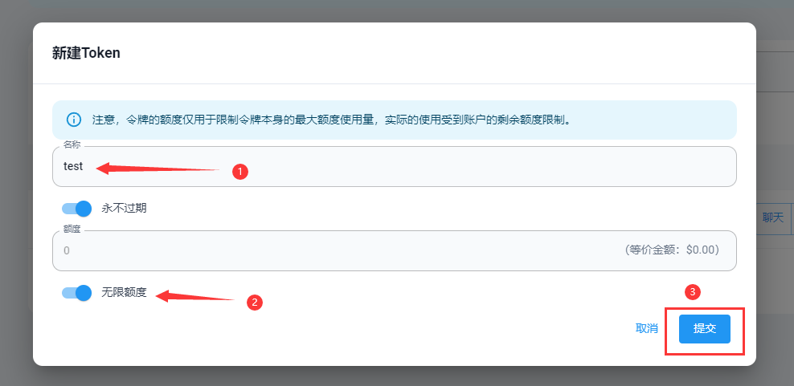
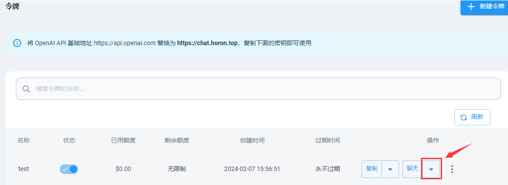
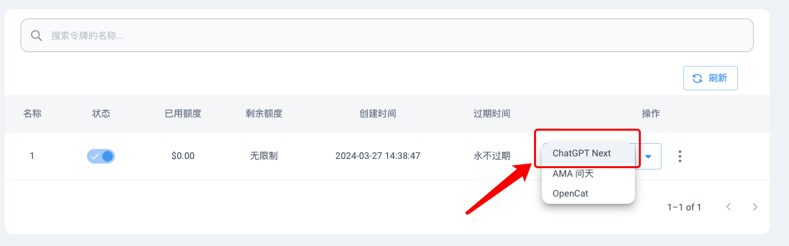

# **欢迎使用HoronGPT，尽情使用方便快捷的ChatGPT吧！**

交流、服务QQ群：599543095

也可以[点击此链接](http://qm.qq.com/cgi-bin/qm/qr?_wv=1027&k=79fa_VGQKkJQ1H0MYWJz_eeXuC0zWM2i&authKey=azLIRhU18bFI4NpaKiGDNCvn5WL2P%2BR0HY%2BIdihDZ%2FanJSSoDS%2FfnHlzVgXVn0T4&noverify=0&group_code=599543095)或者扫码加群

## **如何使用？**

-   进入官网：[https://chat.horon.top](https://chat.horon.top/)
-   点击上方菜单“登录”然后注册账户，前往[费率&额度](/HoronGPT/Charge&Limit.html)页面查看充值详情，然后联系站长支付额度后，站长会为你的账户充值余额，当你的账户在“充值”界面有余额后如图

-   点击上方菜单的“令牌“，点击”添加新令牌“，再填写你想为这张令牌添加到限制参数，最后点击提交即可（令牌的额度设置超出账户剩余额度仍旧会受到剩余额度限制）

-   最后一步，在“令牌”页面看到创建的令牌后，点击“聊天”按钮边上的“🔽”，然后在下拉栏中选择“ChatGPT Next”后会跳转新页面，稍等一会儿在弹出的窗口中选择“确认”导入令牌后，即可开始聊天

